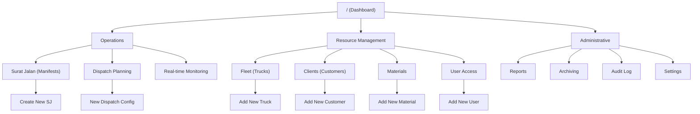
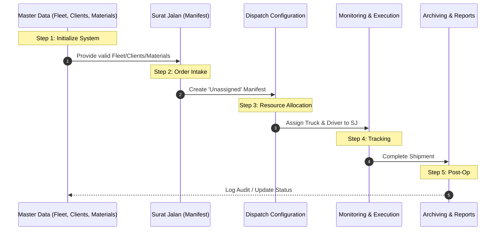

# Logistics System Design: "Fleet Ops"

## System Overview
**Fleet Ops** (atau Stitch Logistics) adalah sistem manajemen logistik terpadu yang dirancang untuk mengelola siklus hidup pengiriman barang, mulai dari manajemen aset (armada) hingga pemantauan pengiriman secara real-time. Sistem ini berfokus pada efisiensi alokasi sumber daya, akurasi data manifest (Surat Jalan), dan transparansi operasional melalui dashboard monitoring yang interaktif.

---

## 1. Sitemap (Struktur Navigasi)

Sitemap ini menggambarkan hierarki halaman dalam aplikasi, yang dibagi menjadi empat pilar fungsional utama:

### Deskripsi Modul:
*   **Dashboard Utama (`/`)**: Pusat ringkasan data (overview) yang memberikan akses cepat ke modul-modul utama melalui kartu navigasi.
*   **Operations (Operasional)**:
    *   **Surat Jalan (SJ)**: Daftar semua dokumen manifest pengiriman. Di sini pengguna bisa melihat status SJ (Draft, Unassigned, Dispatched).
    *   **Dispatch Planning**: Halaman khusus untuk mengalokasikan armada dan pengemudi ke Surat Jalan yang masih berstatus 'Unassigned'.
    *   **Real-time Monitoring**: Dashboard visual (peta) untuk melacak posisi dan status pengiriman yang sedang berjalan.
*   **Resource Management (Master Data)**:
    *   **Fleet**: Database kendaraan, spesifikasi teknis (berat/volume), dan status kesiapan (Ready/In Use).
    *   **Clients/Customers**: Manajemen profil pelanggan, lokasi tujuan, dan data penagihan.
    *   **Materials**: Database barang/material yang sering dikirim, termasuk berat jenis dan cara penanganan.
    *   **User Access**: Pengaturan personel organisasi dan hak akses mereka.
*   **Administrative (Administrasi)**:
    *   **Reports**: Generasi laporan performa seperti utilitas armada dan volume pengiriman.
    *   **Archiving**: Penyimpanan data pengiriman yang sudah selesai untuk referensi masa depan.
    *   **Audit Log**: Catatan riwayat aktivitas pengguna untuk keamanan dan pelacakan kesalahan.

---

## 2. Operational Workflow (Alur Kerja)

Alur kerja ini menjamin konsistensi data dari tahap persiapan hingga penyelesaian tugas operasional.

### Deskripsi Alur:
1.  **Sistem Inisialisasi**: Sebelum operasional dimulai, admin memastikan data Armada (Fleet), Pelanggan (Clients), dan Material sudah terdaftar dengan benar.
2.  **Input Order (Create SJ)**: Ketika ada permintaan pengiriman, dispatcher membuat **Surat Jalan (SJ)** baru. Di tahap ini, detail barang, berat, volume, dan tujuan ditentukan. Status SJ menjadi **"Unassigned"**.
3.  **Alokasi Sumber Daya (Dispatch)**: Dispatcher memilih SJ yang belum dialokasikan, lalu memilih kendaraan dan pengemudi yang tersedia. Setelah dikonfirmasi, status SJ berubah menjadi **"Dispatched"**.
4.  **Eksekusi & Pemantauan**: Pengiriman berjalan dan dipantau melalui dashboard **Monitoring**. Sistem mencatat estimasi kedatangan (ETA) dan rute perjalanan.
5.  **Finalisasi & Pelaporan**: Setelah barang sampai, data dipindahkan ke **Archiving**. Aktivitas ini tercatat di **Audit Log** dan data volume masuk ke modul **Reports**.

---

## 3. Use Cases (Skenario Penggunaan)

Skenario terperinci untuk interaksi pengguna dengan sistem:

### A. Dispatcher (Pengelola Operasional)
*   **Deskripsi**: Dispatcher bertanggung jawab atas kelancaran arus barang.
*   **Skenario Utama**: Menerima pesanan pelanggan, membuat manifest barang di modul SJ, dan memastikan kapasitas kendaraan optimal (tidak overload) melalui kalkulator berat otomatis di form SJ.
*   **Hasil**: Manifest PDF dihasilkan dan pengiriman siap dijadwalkan.

### B. Fleet Manager (Pengelola Armada)
*   **Deskripsi**: Memastikan semua aset kendaraan dalam kondisi prima dan terdata.
*   **Skenario Utama**: Menambahkan truk baru ke sistem, memantau masa berlaku STNK/ijin lainnya, dan menandai kendaraan sebagai "Maintenance" jika sedang diperbaiki agar tidak muncul di pilihan Dispatch.
*   **Hasil**: Daftar pilihan kendaraan di modul Dispatch selalu akurat.

### C. Monitoring Officer / Viewer
*   **Deskripsi**: Memantau operasional harian tanpa melakukan perubahan data sensitif.
*   **Skenario Utama**: Membuka dashboard Monitoring untuk melihat titik koordinat armada dan memastikan tidak ada keterlambatan yang signifikan pada pengiriman prioritas tinggi.
*   **Hasil**: Transparansi status pengiriman bagi pelanggan atau manajemen.

### D. Senior Management & Finance
*   **Deskripsi**: Membutuhkan data agregat untuk keputusan bisnis.
*   **Skenario Utama**: Mengakses modul Reports di akhir bulan untuk melihat total tonase yang dikirim dan biaya operasional per rute guna evaluasi profitabilitas.
*   **Hasil**: Laporan performa bulanan yang akurat untuk strategi bisnis ke depan.
